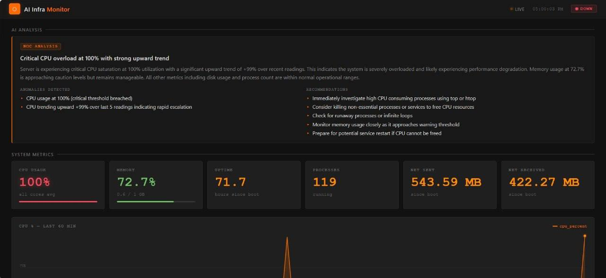

# AI Infra Monitor

A production-grade infrastructure monitoring dashboard with AI-powered health analysis. Collects live system metrics, runs automated analysis, and displays everything on a real-time dashboard.

> Live metrics collection → AI analysis → real-time dashboard. Deployed on a Linux VPS behind Cloudflare.

---

## Live Demo

🔗 **[monitor.ado-runner.com](https://monitor.ado-runner.com)**



---

## What It Does

Every 15 minutes, a cron job collects live system metrics from the host server. Those metrics are sent to an **AI analysis engine**, which returns a structured health assessment. The dashboard auto-refreshes and displays everything in real time.

**Metrics collected:**
- CPU usage % with trend detection (rising/falling over last 5 readings)
- Memory usage (used / total GB)
- Disk usage per mount point
- Network I/O (cumulative sent/received)
- System uptime and process count

**AI analysis output:**
- **Status:** `green` / `yellow` / `red` with thresholds (CPU >80% = yellow, >95% = red, etc.)
- **Headline:** one-sentence plain-English summary
- **Plain-English narrative** for on-call engineers
- **Anomalies detected** (specific deviations from baseline)
- **Recommended actions**

---

## Sample Output

### Collector Log

```
$ tail -f logs/collector.log

[06:45:01] Collected — CPU: 12.4% | MEM: 74.2% | Processes: 142
[07:00:01] Collected — CPU: 13.1% | MEM: 74.8% | Processes: 144
[07:15:01] Collected — CPU: 11.8% | MEM: 73.9% | Processes: 141
```

### Analyzer Output (Green)

```
$ python analyzer.py

Status: GREEN — All systems operating within normal parameters.
```

### Analyzer Output (Degraded)

```
$ python analyzer.py

Status: YELLOW — Elevated memory usage detected. Monitor for further increase.
```

### API Response — `/api/status`

```json
{
  "status": "green",
  "headline": "All systems operating within normal parameters.",
  "cpu_percent": 12.4,
  "memory_percent": 74.2,
  "disk_percent": 41.0,
  "uptime_hours": 312.7,
  "process_count": 142,
  "timestamp": "2026-04-20T07:00:01+00:00"
}
```

### API Response — `/api/metrics` (truncated)

```json
{
  "latest": {
    "cpu_percent": 12.4,
    "memory": { "percent": 74.2, "used_gb": 0.74, "total_gb": 1.0 },
    "disks": [{ "mountpoint": "/", "percent": 41.0 }],
    "network": { "sent_mb": 1842.3, "recv_mb": 4201.7 },
    "uptime_hours": 312.7,
    "process_count": 142,
    "timestamp": "2026-04-20T07:00:01+00:00"
  },
  "analysis": {
    "status": "green",
    "headline": "All systems operating within normal parameters.",
    "narrative": "CPU is well within normal range at 12.4%. Memory at 74.2% is elevated but stable — typical for a 1GB VPS running multiple services. Disk usage at 41% provides adequate headroom. No anomalies detected.",
    "anomalies": [],
    "recommendations": ["Continue monitoring memory trend over the next few cycles."]
  },
  "history": [ ... ]
}
```

---

## Architecture

```
VPS
├── collector.py       # cron (every 15 min) — psutil metrics → data/metrics.json
├── analyzer.py        # cron (every 15 min, +3 min offset) — metrics → Claude API → analysis
├── api.py             # Flask/Gunicorn — serves /api/metrics, /api/status, /health
├── templates/
│   └── index.html     # live dashboard (vanilla JS, no framework, no build step)
└── data/
    └── metrics.json   # rolling 60-snapshot history + latest AI analysis
```

```
Browser ──► Cloudflare (SSL/DDoS) ──► Nginx (reverse proxy) ──► Gunicorn:5000
                                                                       │
                                                               Claude API (Anthropic)
```

**Key design decisions:**
- Gunicorn binds to `127.0.0.1:5000` only — never exposed directly
- Nginx handles all public traffic; Cloudflare sits in front for SSL termination and DDoS protection
- Metrics stored as flat JSON — no database dependency, simple and auditable
- AI analysis decoupled from collection — analyzer failures don't break the dashboard

---

## Tech Stack

| Layer | Technology |
|---|---|
| Metrics collection | Python 3, psutil |
| AI analysis | Anthropic Claude API (`claude-haiku-4-5`) |
| API server | Flask 3, Gunicorn |
| Frontend | Vanilla HTML/CSS/JS — no framework, no build step |
| Reverse proxy | Nginx |
| CDN / SSL | Cloudflare |
| Process management | systemd |
| Scheduler | cron |
| OS / Hosting | Ubuntu 24.04 VPS |

---

## API Endpoints

| Endpoint | Description |
|---|---|
| `GET /` | Live dashboard UI |
| `GET /api/metrics` | Full metrics payload + AI analysis + 60-snapshot history |
| `GET /api/status` | Lightweight health check (status, headline, key metrics) |
| `GET /health` | Liveness probe |

---

## Setup

### 1. Clone & install dependencies

```bash
git clone https://github.com/ohdasdiego/ai-infra-monitor.git
cd ai-infra-monitor
python3 -m venv venv
source venv/bin/activate
pip install -r requirements.txt
```

### 2. Configure environment

```bash
cp .env.example .env
# Edit .env and add your ANTHROPIC_API_KEY
```

### 3. Verify locally

```bash
# Collect a metrics snapshot
python collector.py
# → [timestamp] Collected — CPU: X% | MEM: Y% | Processes: Z

# Run AI analysis
python analyzer.py
# → Status: GREEN — All systems operating within normal parameters

# Start the API server
gunicorn api:app --bind 0.0.0.0:5000
# → Dashboard at http://localhost:5000
```

### 4. Set up cron jobs

```bash
crontab -e
```

```cron
# Collect metrics every 15 minutes
*/15 * * * * cd /home/YOUR_USER/ai-infra-monitor && venv/bin/python collector.py >> logs/collector.log 2>&1

# Run AI analysis every 15 minutes (offset by 3 min to avoid overlap)
3-59/15 * * * * cd /home/YOUR_USER/ai-infra-monitor && venv/bin/python analyzer.py >> logs/analyzer.log 2>&1
```

### 5. Deploy as a systemd service

```bash
# Edit infra-monitor.service — replace YOUR_LINUX_USER with your username
sudo cp infra-monitor.service /etc/systemd/system/
sudo systemctl daemon-reload
sudo systemctl enable infra-monitor
sudo systemctl start infra-monitor
```

### 6. Nginx reverse proxy

```bash
# Edit nginx.conf — replace YOUR_DOMAIN with your domain
sudo cp nginx.conf /etc/nginx/sites-available/ai-infra-monitor
sudo ln -s /etc/nginx/sites-available/ai-infra-monitor /etc/nginx/sites-enabled/
sudo nginx -t && sudo systemctl reload nginx
```

Point Cloudflare DNS to your server IP with the orange cloud (proxied) enabled.

---

## Cost Analysis

Understanding API cost at scale is critical for production deployments. Here's the projected spend at different polling intervals using `claude-haiku-4-5` pricing ($1.00/M input tokens, $5.00/M output tokens):

| Interval | Calls/day | Calls/month | Input tokens/mo | Output tokens/mo | Est. cost/mo |
|---|---|---|---|---|---|
| Every 1 min | 1,440 | 43,200 | ~14.2M | ~10.8M | ~$68 |
| Every 5 min | 288 | 8,640 | ~2.8M | ~2.2M | ~$14 |
| Every 15 min | 96 | 2,880 | ~948K | ~720K | ~$5 |
| **Every 30 min** | **48** | **1,440** | **~474K** | **~360K** | **~$2** |
| Every 60 min | 24 | 720 | ~237K | ~180K | ~$1 |

> **Current config:** Every 15 minutes (~$5/month). Adjust polling frequency in `crontab` to tune cost vs. freshness.

**Per-call breakdown (15-min interval):**
- ~329 input tokens (system prompt + metrics payload)
- ~250 output tokens (structured JSON analysis)
- ~$0.0015 per analysis call

**Scaling note:** At enterprise scale with hundreds of hosts, the right architecture would batch metrics from multiple servers into a single API call rather than one call per host — dramatically reducing per-host cost.

---

## Skills Demonstrated

This project is intentionally production-aligned — not a local toy:

- **Linux systems ops** — systemd service management, cron scheduling, process supervision, log routing
- **Infrastructure monitoring** — real metric collection from a live host, rolling history, threshold-based alerting logic
- **AI/API integration** — structured prompting, JSON schema enforcement, error handling, API key hygiene
- **Network operations** — Nginx reverse proxy config, Cloudflare integration, UFW firewall hardening, port exposure management
- **Incident analysis mindset** — status levels, anomaly detection, plain-English summaries for on-call engineers
- **Security hygiene** — secrets in `.env` (gitignored), gunicorn bound to loopback only, Cloudflare as the public face

---

## 🗺️ Roadmap

- [ ] Multi-host support — aggregate metrics from multiple servers into a single dashboard
- [ ] Configurable alert thresholds via UI — no config file edits required
- [ ] Email/PagerDuty notification support alongside Telegram
- [ ] Historical trend graphs — 7-day and 30-day CPU/memory charts
- [ ] Anomaly baseline learning — flag deviations from host-specific norms rather than fixed thresholds

---

## ADOStack

| # | Project | Live | Role |
|---|---------|------|------|
| **1** | **AI Infra Monitor** | **[monitor.ado-runner.com](https://monitor.ado-runner.com)** | **← You are here** |
| 2 | [AI Incident Logger](https://github.com/ohdasdiego/ai-incident-logger) | [incidents.ado-runner.com](https://incidents.ado-runner.com) | Threshold alerting + incident records |
| 3 | [Code Auditor](https://github.com/ohdasdiego/code-auditor) | CLI | AI-powered code review |
| 4 | [RAG Runbook Assistant](https://github.com/ohdasdiego/rag-runbook-assistant) | [runbooks.ado-runner.com](https://runbooks.ado-runner.com) | Vector search over IT runbooks |
| 5 | [K8s Event Summarizer](https://github.com/ohdasdiego/k8s-event-summarizer) | [k8s.ado-runner.com](https://k8s.ado-runner.com) | Kubernetes cluster health digests |
| 6 | [AI Incident Orchestrator](https://github.com/ohdasdiego/ai-incident-orchestrator) | [orchestrator.ado-runner.com](https://orchestrator.ado-runner.com) | Multi-agent triage pipeline |
| 7 | [On-Call Assistant](https://github.com/ohdasdiego/oncall-assistant) | [oncall.ado-runner.com](https://oncall.ado-runner.com) | Incident response + escalation routing |

---

## Author

**Diego Perez** · [github.com/ohdasdiego](https://github.com/ohdasdiego/ai-infra-monitor)
